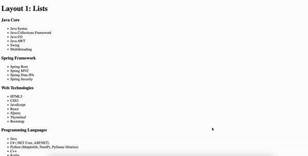

<h1 align="center">Skills Section Layouts</h1>

<h2>Project description</h2>
This React application demonstrates various layout options for presenting a skills section in a portfolio. The app includes four distinct layouts: a categorized list with icons, a bento-styled grid, horizontal tabs, and an accordion. Each layout provides a unique way to showcase skills, making it versatile for different design preferences and needs.

<h2>Features</h2>
<ul>
  <li><b>Categorized List with Icons:</b> A simple and clear layout where skills are grouped by category in list format.</li>
  <li><b>Bento-styled Grid:</b> An aesthetically pleasing grid layout that organizes skills in a visually appealing manner.</li>
  <li><b>Horizontal Tabs:</b> A tabbed interface allowing users to switch between different skill categories.</li>
  <li><b>Accordion:</b> A collapsible list that expands to show the skills under each category.</li>
</ul>

<h2>Technologies Used</h2>

<h2>Getting Started</h2>
To get a local copy up and running, follow these simple steps.

<h3>Prerequisites</h3>
Make sure you have npm installed. You can get it by installing Node.js.

<h3>Installation</h3>
<h5>Clone the repository:</h5>
https://github.com/Yuliia-Kruta/skills-section-layouts.git

<h5>Navigate to the project directory:</h5>
cd skills-section-layouts

<h5>Install the dependencies:</h5>
npm install

<h5>Start the development server:</h5>
npm start
  
The app will be available at http://localhost:3000.

<h2>License</h2>
Distributed under the MIT License. See LICENSE for more information.
